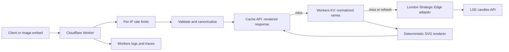

# ticker-line — Implementation overview

This document is the evergreen technical overview for ticker-line. It describes the as-built architecture, invariants, and operating model. Source code, tests, `package.json`, and `wrangler.jsonc` are authoritative for exact signatures and configuration; changes to those systems should keep this overview current.

## System shape

ticker-line is one Cloudflare Worker serving two workloads from `ticker-line.com`:

- Worker routes for `/v1/*` and `/health*`.
- Astro-generated static assets for the documentation site and crawler metadata.



The Worker entrypoint exports a Hono application. Bindings are read from the request context; no request-scoped secret, cache instance, or mutable state is stored globally.

## Runtime and dependencies

The implementation uses:

- TypeScript in strict mode.
- Hono for Worker routing.
- Zod for environment, provider, and cache-record validation.
- Cloudflare Workers Static Assets for the Astro output.
- Workers KV for normalized market data and negative records.
- The Workers Cache API for rendered SVG and JSON artifacts.
- Cloudflare Rate Limiting bindings for burst and sustained IP controls.
- Workers Logs and traces for production observability.
- Vitest, the Cloudflare Workers test pool, fast-check, Resvg, Pixelmatch, Playwright, and Axe for verification.

`package.json` pins the supported package ranges and Node.js engine. `package-lock.json` is committed and CI installs with `npm ci`.

## Repository layout

```text
src/
  app.ts                    HTTP application and request lifecycle
  cache/                    Cache keys, KV records, and response artifacts
  domain/                   Public request, timeframe, series, and error types
  http/                     Query parsing, headers, rate limiting, error responses
  providers/lse/            LSE schema, symbol mapping, and adapter
  render/                   Sampling, geometry, styles, and SVG serialization
  services/series.ts        Data-cache state machine and one-day selection
  telemetry/logger.ts       Structured logger
site/
  layouts/                  Static document shell and metadata
  pages/                    Documentation, 404 page, and sitemap
  scripts/                  Progressive request-builder enhancement
  styles/                   Geist-based global design system
test/
  fixtures/                 Sanitized provider fixtures
  unit/                     Domain and Worker behavior tests
  visual/                   Rasterized renderer comparisons
e2e/                       Browser and accessibility tests
docs/                       Product, implementation, and provider references
```

## Request lifecycle

`createApp` in `src/app.ts` wires the request flow:

1. Generate a request ID.
2. Determine the requested output mode so validation failures can choose JSON or SVG representation.
3. Apply burst and sustained rate limits using `CF-Connecting-IP` as the key.
4. Validate and canonicalize query parameters.
5. Validate Worker environment bindings and version variables.
6. Build a versioned response-cache key and check the Cache API.
7. On a response-cache miss, load a normalized series from KV or the provider.
8. Render the SVG and, when requested, the JSON envelope.
9. Store fresh rendered artifacts asynchronously with `waitUntil`.
10. Apply conditional-request, CORS, security, cache, and request-ID headers.
11. Map failures through the single public error model.
12. Emit one structured completion event.

`HEAD` follows the same behavior but returns no body. `OPTIONS` returns the documented CORS policy. `/health` does not read configuration, KV, rate limits, or the provider.

## Request validation and canonicalization

`src/http/query.ts` owns the public query boundary.

- Maximum URL length: 2,048 characters.
- Maximum ticker length: 32 characters.
- Accepted ticker characters: letters, numbers, `.`, `/`, `^`, `=`, `_`, and `-`.
- Accepted parameters: `ticker`, `timeframe`, `theme`, `fill`, and `format`.
- Unknown or duplicated parameters fail with `INVALID_REQUEST`.
- Tickers are trimmed and uppercased.
- Defaults are `timeframe=1m`, `theme=light`, `fill=false`, and `format=svg`.

Canonical serialization uses a fixed field order. Response cache keys use the parsed values, not the original query string, so casing, parameter order, and omitted defaults do not create duplicate artifacts.

## Domain contract

Provider adapters return a normalized `MarketSeries`:

```ts
type MarketSeries = {
  resolvedTicker: string;
  assetType: "stock" | "crypto" | "etf" | "index" | "forex" | "unknown";
  currency?: string;
  exchange?: string;
  timezone?: string;
  dataAsOf: string;
  referenceClose: number;
  points: readonly { timestamp: number; close: number }[];
};
```

Rendering and caching consume this domain type and never consume raw provider payloads.

## London Strategic Edge adapter

`src/providers/lse/adapter.ts` calls the LSE candles endpoint with `x-api-key` authentication. It sends the mapped symbol, source interval, UTC start/end dates, ascending order, and a 5,000-row limit.

Provider boundaries:

- One 10-second overall deadline, shared across attempts.
- At most two attempts; only transient network or provider `5xx` failures are retried while deadline remains.
- `401` and `403` become provider authentication failures without retry.
- `404` becomes a provider not-found error.
- `422` becomes a provider schema/request error.
- `429` preserves `Retry-After` when parseable and is not retried by the adapter.
- Response bodies are bounded to 2 MiB before JSON parsing.
- Payloads are validated with Zod.
- Timezone-less LSE timestamps are parsed explicitly as UTC.
- Invalid timestamps and non-finite closes are dropped.
- Duplicate timestamps keep the last valid row; points are sorted ascending.
- Empty normalized output becomes `INSUFFICIENT_DATA`.

Aliases in `src/providers/lse/symbols.ts` translate selected public symbols to LSE syntax and supply known asset type/currency metadata. Slash-form public symbols work directly. The alias layer is intentionally small and does not pretend to be a general symbol-resolution service.

## Timeframes and one-day selection

`src/domain/timeframe.ts` maps each public timeframe to a provider interval and a point target:

| Timeframe | Interval | Target points |
| --- | --- | --- |
| `1d` | `15m` | 128 |
| `7d` | `1h` | 168 |
| `1m` | `1d` | 31 |
| `3m` | `1d` | 92 |
| `1y` | `1d` | 250 |
| `5y` | `1w` | 250 |

Calendar ranges use UTC-safe day, month, and year subtraction.

One-day requests widen the provider lookback to eight days so reference and visible prices come from one provider call. `selectOneDaySeries` treats crypto and forex as continuous. Other assets are session-based and use a gap greater than two hours to find the latest session boundary. When a previous-session candle exists, it becomes `referenceClose`; otherwise the first visible close is used.

## Normalized data cache

`MarketDataCache` stores validated schema-versioned records in the `MARKET_DATA_CACHE` KV binding. Records include:

- fetch, fresh-until, stale-until, and optional retry-after timestamps;
- the provider request range and source interval;
- normalized metadata, reference close, and points.

Keys contain the cache-policy, provider, provider-version, normalization-version, ticker, timeframe, and interval. Schema-invalid values are treated as misses and generate a warning rather than breaking a request.

Freshness policy:

| Timeframe | Fresh | Stale after freshness |
| --- | --- | --- |
| `1d` | 1,500 seconds | 3,600 seconds |
| `7d` | 6,000 seconds | 21,600 seconds |
| `1m` | 18,000 seconds | 86,400 seconds |
| `3m` | 36,000 seconds | 86,400 seconds |
| `1y` | 72,000 seconds | 259,200 seconds |
| `5y` | 432,000 seconds | 604,800 seconds |

Cache behavior:

- Fresh records are returned without a provider call.
- Stale records are returned immediately.
- A stale record starts a background refresh through `waitUntil` when retry backoff permits.
- Failed background refreshes set a 60-second retry backoff.
- Expired records are not served and require a foreground provider request.
- KV records expire five minutes after their logical stale boundary for cleanup.

Negative records use separate keys. Not-found records live for 300 seconds; insufficient-data records live for 600 seconds.

Workers KV does not provide global single-flight coordination. The cache reduces provider traffic but does not guarantee that simultaneous cold misses in different locations collapse into one upstream request.

## Rendered response cache

`ResponseArtifactCache` uses `caches.default`. Its internal URL key includes renderer version, normalization version, ticker, timeframe, theme, fill, and format.

Only stable response headers and the body are cached. Request IDs are attached after cache retrieval and are never stored. Artifacts are logically bounded by the underlying data's `freshUntil`; an expired artifact is deleted and treated as a miss.

SVG and JSON are separate entries. A stale market-data result is rendered for the current request but is not inserted into the response cache. Cache API writes are asynchronous and do not delay the response.

Successful responses include:

- `Cache-Control` with browser, shared-cache, and stale directives;
- a SHA-256 strong `ETag`;
- `X-Data-As-Of`;
- `X-Cache`;
- a request-specific `X-Request-Id`.

Browser `max-age` is capped at 60 seconds and restored after cached retrieval. `If-None-Match` returns `304` when it matches the current artifact.

## Renderer

The renderer is a dependency-free SVG serializer with fixed `160 × 48` geometry.

1. Filter to finite points, preserve stable timestamp ordering, and sample deterministically.
2. Compute padded chart geometry and the reference-price baseline.
3. Split line runs exactly where they cross the baseline.
4. Render green runs above and red runs below the baseline.
5. Render the dotted horizontal reference line.
6. Optionally close each run to the baseline for a matching translucent fill.
7. Escape the title and description and serialize controlled SVG elements.

Successful SVGs allow generated `<svg>`, `<path>`, `<title>`, and `<desc>` content. Error SVGs add one controlled `<text>` node. No provider markup, arbitrary attributes, script, event handlers, external references, or foreign objects are accepted.

The same points, reference close, options, and renderer version must produce byte-identical output. Visible output changes require snapshot review, visual-test updates, and a renderer-version increment.

## JSON and error output

JSON serialization is intentionally flat and ordered. Quote numbers are stabilized before serialization. Currency is omitted rather than guessed when unavailable.

All internal failures pass through `toPublicError`, which produces one of:

- `INVALID_REQUEST`
- `TICKER_NOT_FOUND`
- `INSUFFICIENT_DATA`
- `RATE_LIMITED`
- `PROVIDER_ERROR`
- `SERVICE_UNAVAILABLE`

JSON responses retain semantic HTTP status and are `no-store` on error. SVG-mode failures return a deterministic fallback with transport status `200`, `X-Error-Code`, and `X-Error-Status`. Fallback cache durations depend on error type; transient provider/service failures are retried quickly, while deterministic lookup failures can be cached briefly.

Fallback output ignores theme, fill, ticker, provider message, and request ID. This keeps one safe artifact per public error code and fallback-renderer version.

## Fair-use rate limiting

The Worker applies both rate-limit bindings before request validation:

- `SPARKLINE_BURST_RATE_LIMITER`: 20 requests per 10 seconds.
- `SPARKLINE_RATE_LIMITER`: 60 requests per 60 seconds.

The key is `CF-Connecting-IP`, falling back to `anonymous` when absent. Burst protection runs first. A rejection throws the normal `RateLimitedError` with a 10- or 60-second retry hint.

Cloudflare's location-scoped rate-limit binding is an abuse control rather than exact billing or a global provider quota. A separate coordinated upstream governor would be required before public traffic could approach a provider-account hard limit.

The application uses the IP only as a binding key and does not include it in structured logs.

## HTTP and security headers

API responses set:

- `Access-Control-Allow-Origin: *`;
- explicit exposed operational headers;
- `Referrer-Policy: no-referrer`;
- `X-Content-Type-Options: nosniff`;
- a sandboxed, no-source content security policy for SVG.

Preflight allows `GET`, `HEAD`, and `OPTIONS` and caches for one day. Method responses include `Allow` where applicable.

Provider credentials are read from the `LSE_API_KEY` Worker secret. `.dev.vars` is gitignored; `.dev.vars.example` contains only a placeholder. Secrets never belong in `wrangler.jsonc`, commands, logs, cache keys, or responses.

## Observability

The logger writes structured objects through `console.log`, `console.warn`, and `console.error` so Workers Logs can index fields.

One request-completion event records the request ID, route, method, transport and semantic status, outcome, public error code, cache state, duration, and validated request options. Provider and refresh failures add sanitized type, attempt, status, and duration metadata.

Logs exclude:

- provider credentials and secret-bearing URLs;
- raw provider responses;
- SVG and JSON bodies;
- full IP addresses;
- full user-agent strings.

Production logs and invocation logs are enabled. Traces sample 1% in production and 10% in staging. Error events are emitted at error or warning level before the completion event.

## Website

Astro builds static HTML into `dist`. Workers Static Assets serves it without invoking Worker code except for routes listed in `run_worker_first`.

The core documentation is server-rendered and useful without JavaScript. `site/scripts/request-builder.ts` progressively enhances:

- theme persistence in local storage;
- copy buttons;
- ticker presets and market cards;
- generated URLs;
- debounced preview updates;
- live JSON-backed market-card data.

The site uses self-hosted Geist fonts, semantic HTML, one global stylesheet, responsive layouts, keyboard focus states, and reduced-motion support. Metadata includes canonical and Open Graph tags, JSON-LD, favicon, social card, `robots.txt`, and sitemap.

## Cloudflare configuration

`wrangler.jsonc` is the source of truth.

| Concern | Production | Staging |
| --- | --- | --- |
| Worker | `ticker-line-api` | `ticker-line-api-staging` |
| Host | `ticker-line.com` | `*.workers.dev` preview URL |
| KV | `ticker-line-market-data-cache` | `ticker-line-market-data-cache-staging` |
| Rate-limit namespaces | Production-only IDs | Staging-only IDs |
| Environment variable | `APP_ENV=production` | `APP_ENV=staging` |
| Observability | Logs plus 1% traces | Logs plus 10% traces |

Static assets use automatic trailing-slash handling and the generated 404 page. The Worker runs first for `/v1/*` and `/health*`.

Version variables provide cache roll-forward controls:

- `PROVIDER_VERSION`
- `CACHE_POLICY_VERSION`
- `NORMALIZATION_VERSION`
- `RENDERER_VERSION`

Changing behavior without updating the appropriate version can leave incompatible cached records or artifacts reachable.

## Local development

Requirements are Node.js 22.12 or newer, npm, Wrangler 4, and an LSE API key for live provider requests.

```sh
npm ci
cp .dev.vars.example .dev.vars
npm run dev:api
```

`npm run dev:site` runs Astro separately for documentation work. Normal full-stack browser tests start the Worker development server, which serves the built static site.

Never commit `.dev.vars` or print its contents. Local bindings use Wrangler's local simulation unless explicitly configured otherwise.

## Verification strategy

The default suite does not call the live provider.

### Unit and Worker tests

Vitest runs through `@cloudflare/vitest-pool-workers`. Tests cover request parsing, canonical keys, timeframe arithmetic, cache state transitions, rate limits, provider fixtures and failures, sampling, renderer output, public errors, headers, JSON quote math, structured logging, and response-cache behavior.

Property tests cover canonicalization and renderer/sampling invariants. Provider fixtures are sanitized and bounded.

### Visual tests

Resvg rasterizes deterministic SVG fixtures and Pixelmatch compares output. Visual cases include directional lines, fills, reference line, themes, and every fallback code. Any intentional visual change updates snapshots and the renderer version together.

### Browser tests

Playwright runs desktop Chromium and a mobile Chromium profile. Network calls are mocked for deterministic page tests. Coverage includes request-builder synchronization, slash tickers, market cards, mobile wrapping, light/dark styling, fallback presentation, metadata, 404 behavior, and Axe accessibility checks.

### Standard gates

```sh
npm run check
npm run test:visual
npm run test:e2e
npx wrangler types --check
```

`npm run check` performs formatting validation, linting, TypeScript and Astro checks, unit tests, the static build, and a Worker dry-run bundle.

CI runs the quality/visual and browser gates independently with read-only repository permissions.

## Deployment and smoke tests

Build and dry run:

```sh
npm run build
```

Deploy staging, validate it, then deploy production:

```sh
npm run deploy:staging
npm run deploy
```

Both deployment scripts build the Astro site and upload `LSE_API_KEY` from the gitignored `.dev.vars` file without printing it. A deployed smoke test should verify:

- `/health` returns `200` and `{ "status": "ok" }`;
- `/` contains the documentation shell and current asset hash;
- one SVG sample has the correct content type and no error header;
- one JSON sample contains quote fields and an SVG;
- one invalid SVG request renders the fallback and error headers;
- mobile and desktop browser layouts load without console or accessibility errors.

Use `wrangler versions list`, `wrangler versions view`, and `wrangler rollback` for deployment history and recovery.

## Change invariants

Every change should preserve these properties unless the public contract changes intentionally:

- No provider call on a fresh data-cache hit.
- No provider call on a rendered-response hit.
- No request-specific ID stored in a cache artifact.
- No stale response cached as fresh output.
- No unknown parameter accepted or used as a cache dimension.
- No raw provider response or credential in logs, errors, or caches.
- No SVG output containing scriptable or unescaped user/provider markup.
- No second provider call solely to compute one-day quote change.
- No visual contract change without renderer-version and fixture review.
- No data/cache schema change without the corresponding version update.
- No default test that consumes live provider quota.

## Extension points

Future capabilities should attach to existing boundaries:

- Additional providers implement `MarketDataProvider` and explicit compatibility rules.
- More accurate exchange calendars belong behind market-state/session logic.
- Strong global cold-miss coordination belongs behind the data-cache service, potentially using Durable Objects.
- PNG or another output format becomes a separate renderer and cache dimension.
- Authentication belongs at HTTP middleware boundaries and never in image query strings.
- Higher-cardinality metrics belong in Analytics Engine only when built-in telemetry is insufficient.

## Technical references

- [Cloudflare Workers best practices](https://developers.cloudflare.com/workers/best-practices/workers-best-practices/)
- [Workers Static Assets](https://developers.cloudflare.com/workers/static-assets/)
- [Workers Cache API](https://developers.cloudflare.com/workers/runtime-apis/cache/)
- [Workers KV](https://developers.cloudflare.com/kv/concepts/how-kv-works/)
- [Workers Rate Limiting binding](https://developers.cloudflare.com/workers/runtime-apis/bindings/rate-limit/)
- [Workers Vitest integration](https://developers.cloudflare.com/workers/testing/vitest-integration/)
- [Wrangler configuration](https://developers.cloudflare.com/workers/wrangler/configuration/)
- [Hono on Cloudflare Workers](https://hono.dev/docs/getting-started/cloudflare-workers)
- [Astro on Cloudflare](https://docs.astro.build/en/guides/deploy/cloudflare/)
- [London Strategic Edge API documentation](https://londonstrategicedge.com/api-documentation/)
- [LSE provider evaluation](./lse-provider-spike.md)
