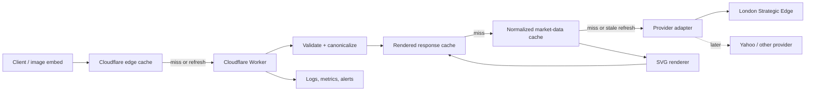

# Ticker Line — Product Requirements Document

- **Status:** Locked for implementation
- **Last updated:** 2026-07-12
- **Owner:** TBD
- **Product name:** Ticker Line
- **Production domain:** `ticker-line.com`

## 1. Product summary

Ticker Line is a hosted, unauthenticated HTTP API that turns a market symbol and timeframe into a compact, static SVG price chart. The primary experience should be as simple as using an image URL:

```html

```

The service will run on Cloudflare Workers, cache generated charts and normalized market data aggressively, and expose a small provider-adapter boundary so additional market data sources can be introduced without changing the public API.

A single-page public website will explain the product, provide interactive examples and API documentation, establish the brand, and capture organic search traffic. The service will be free and open to call without authentication for the initial release. The codebase will remain private at launch.

This product provides a visualization of third-party market data, not trading advice, an execution service, or a guaranteed real-time quote feed.

## 2. Problem

Adding a small stock or crypto chart to a website currently requires developers to acquire market data, normalize provider-specific responses, render a chart, host the result, and design a cache strategy. That is too much setup for an otherwise decorative or contextual UI element.

The product should reduce that work to one stable URL while remaining inexpensive to operate at public-internet traffic levels.

## 3. Goals

### MVP goals

- Generate a deterministic, accessible SVG sparkline from a ticker and timeframe.
- Make the chart directly embeddable in an `` tag, Markdown document, or CSS background.
- Support a small, documented set of style options without creating unbounded cache variation.
- Support stocks and crypto where the selected provider has reliable, licensable data.
- Minimize provider calls through canonical request keys, edge response caching, a shared data cache, and stale-on-error behavior.
- Keep the public API independent from any one upstream data provider.
- Return useful, consistent JSON errors for programmatic clients and deterministic SVG fallback images for embeds.
- Launch a fast, indexable single-page website with docs, examples, brand assets, social metadata, and basic legal/disclaimer content.
- Collect enough operational data to decide whether API keys, paid plans, or more providers are justified.

### Non-goals for MVP

- Real-time or tick-level quotes.
- Candlestick, volume, axis, tooltip, or interactive charting.
- Trading, portfolio tracking, alerts, or financial analysis.
- A symbol-search or market-discovery product.
- User accounts, billing, dashboards, or issued API keys.
- Arbitrary CSS, fonts, gradients, JavaScript, or user-provided SVG fragments.
- Guaranteed coverage of every ticker, exchange, or asset type.
- An open-source release.

## 4. Target users and use cases

### Primary users

- Developers adding financial context to dashboards, status pages, newsletters, READMEs, bots, and small apps.
- Publishers embedding a compact visual beside a market symbol.
- Designers and prototypers who need realistic, current-looking market charts without building a data pipeline.

### Core jobs to be done

- “Give me an embeddable chart for AAPL over the last month.”
- “Give me the same chart in a dark UI, with an optional directional area fill.”
- “Let me inspect when the underlying data was updated and which symbol was resolved.”
- “Continue returning a recent chart during a temporary provider outage.”

## 5. Product principles

1. **A URL is the interface.** The common case must work in an image tag with no SDK or JavaScript.
2. **Stable and cacheable by default.** Equivalent requests resolve to the same canonical key and output bytes.
3. **Small public surface.** Each additional option increases documentation, validation, testing, and cache cardinality.
4. **Provider-neutral contract.** Provider quirks do not leak into the public response unless explicitly surfaced as metadata.
5. **Stale is often better than broken.** A clearly timestamped recent chart is preferable to a transient upstream failure within a defined stale window.
6. **Safe SVG only.** Output is generated from controlled primitives and escaped text; no upstream or user-supplied markup is passed through.

## 6. Proposed MVP experience

### V1 API design

The first version has one public operation: turn a market symbol into a sparkline. The API survey reinforces a few useful patterns:

- Mobula's sparkline endpoint shows that `symbol + timeframe` is enough for the core request.
- QuickChart and Image-Charts show the flexibility of accepting full chart configurations, but that flexibility is unnecessary here and would make validation, documentation, and caching much harder.
- Stockdio and TradingView-style widgets show that interactive embeds solve a different problem than a static image URL.

V1 will therefore expose one GET endpoint, five query parameters, one default chart style, and no provider-specific concepts. There will be no chart-configuration object, arbitrary dates, data arrays, indicators, axes, or provider selection.

### Primary endpoint

```http
GET /v1/sparkline?ticker=AAPL&timeframe=1m
```

The default success response should be raw SVG with `Content-Type: image/svg+xml; charset=utf-8`. When a request in valid SVG mode cannot produce a chart, the endpoint returns a deterministic SVG fallback image instead of a broken image response. Although a JSON envelope is useful programmatically, raw SVG makes the primary embed use case possible. Clients that need metadata, semantic HTTP error statuses, or an SVG string can request JSON explicitly:

```http
GET /v1/sparkline?ticker=AAPL&timeframe=1m&format=json
```

Raw SVG is the V1 default. This keeps the most common integration to one copy-pasteable URL while preserving the initial “JSON of SVG” use case through `format=json`.

### Copy-paste examples

HTML:

```html

```

Markdown:

```md

```

JSON:

```sh
curl "https://ticker-line.com/v1/sparkline?ticker=BTC-USD&timeframe=7d&format=json"
```

### Query parameters

| Parameter | Required | MVP values | Default | Notes |
| --- | --- | --- | --- | --- |
| `ticker` | Yes | Provider-supported symbol | — | Trimmed and normalized to uppercase where safe; examples: `AAPL`, `BTC-USD`, `VOD.L`. |
| `timeframe` | No | `1d`, `7d`, `1m`, `3m`, `1y`, `5y` | `1m` | Calendar range; the server chooses a suitable sampling interval. |
| `theme` | No | `light`, `dark` | `light` | Selects accessible positive, negative, fill, and reference-line colors. |
| `fill` | No | `false`, `true` | `false` | When enabled, fills each positive or negative region between the price line and the first-close reference line. |
| `format` | No | `svg`, `json` | `svg` | `svg` returns the image; `json` returns an envelope. |

The SVG always uses a `160 × 48` intrinsic size and a matching `viewBox`. Because SVG scales without loss, consumers control display size through normal HTML attributes or CSS instead of `width` and `height` API parameters. This avoids two high-cardinality cache dimensions.

Potential parameters such as arbitrary hex colors, fill opacity/style, `width`, `height`, `stroke`, `exchange`, `currency`, `provider`, arbitrary start/end dates, and exact sampling intervals are intentionally deferred. `theme=auto` is also deferred because color inheritance and media-query behavior vary across SVG embedding contexts. If ticker ambiguity proves common, `exchange` should be the first addition.

Parameter names and enum values are lowercase. Unsupported parameters and values return `400` rather than being ignored. The service canonicalizes ticker casing, parameter order, omitted defaults, and the boolean fill value internally so equivalent requests share one cache entry.

### Successful SVG response

```http
HTTP/1.1 200 OK
Content-Type: image/svg+xml; charset=utf-8
Cache-Control: public, max-age=300, stale-while-revalidate=3600, stale-if-error=86400
ETag: "..."
X-Request-Id: req_...
X-Data-As-Of: 2026-07-12T19:45:00Z
X-Cache: HIT
```

The SVG should:

- have an explicit `viewBox`, `width`, and `height`;
- contain only generated `<svg>`, `<path>`, `<title>`, and `<desc>` elements for successful charts in V1;
- render the close price series after filtering invalid points;
- preserve a small visual padding around extrema;
- handle flat series without division-by-zero or an invisible result;
- include a concise title and description for direct document embedding;
- contain no scripts, external references, event handlers, foreign objects, or unescaped provider content;
- produce deterministic output for the same normalized dataset, render options, and renderer version.

### Successful JSON response

```json
{
  "ticker": "AAPL",
  "timeframe": "1m",
  "currency": "USD",
  "dataAsOf": "2026-07-12T19:45:00Z",
  "svg": "<svg ...>...</svg>"
}
```

The JSON envelope is intentionally flat. `resolvedTicker`, `assetType`, point data, provider identity, cache internals, and rendering configuration are not part of the V1 response. `X-Request-Id`, `X-Data-As-Of`, and `X-Cache` headers provide operational context without expanding the body.

`currency` is optional and is omitted when the provider cannot supply it reliably. The service must not infer an equity currency from ticker spelling or exchange suffix solely to populate this field.

### Error responses

JSON mode preserves semantic HTTP error statuses and always returns the debuggable JSON envelope:

```json
{
  "error": {
    "code": "TICKER_NOT_FOUND",
    "message": "No market data was found for ticker 'NOPE'."
  },
  "requestId": "req_..."
}
```

| JSON status | Code | Meaning |
| --- | --- | --- |
| `400` | `INVALID_REQUEST` | Missing or invalid parameter. |
| `405` | `INVALID_REQUEST` | Unsupported HTTP method. |
| `404` | `TICKER_NOT_FOUND` | No supported symbol resolved. |
| `422` | `INSUFFICIENT_DATA` | Symbol exists but cannot produce a chart for the requested range. |
| `429` | `RATE_LIMITED` | Temporary abuse or traffic protection applied. |
| `502` | `PROVIDER_ERROR` | Upstream failed and no acceptable stale copy exists. |
| `503` | `SERVICE_UNAVAILABLE` | Service is temporarily unable to fulfill the request. |

When `format=svg`, or when `format` is omitted and therefore defaults to SVG, the same failures return a fallback image:

```http
HTTP/1.1 200 OK
Content-Type: image/svg+xml; charset=utf-8
X-Error-Code: TICKER_NOT_FOUND
X-Error-Status: 404
X-Request-Id: req_...
```

The fallback SVG must:

- remain `160 × 48` with the normal `viewBox`;
- contain a fixed neutral-gray sparkline plus the public error code as visible text;
- include the error code in `<title>` and a generic explanation in `<desc>`;
- use only generated `<svg>`, `<path>`, `<text>`, `<title>`, and `<desc>` elements;
- never include the requested ticker, provider error, stack trace, or request ID in its body;
- ignore requested theme and fill so each public error code has one deterministic representation;
- set `X-Error-Code` and `X-Error-Status` so non-image clients can detect the underlying failure;
- be deterministic for the same public error code and fallback-renderer version.

SVG-mode failures deliberately use HTTP `200` so browsers render the fallback in an `` element instead of replacing it with a broken-image indicator. Clients that require semantic HTTP error statuses should use `format=json`. An omitted `format` uses the SVG default; if `format` itself is duplicated or invalid, return the normal JSON `400` response.

Errors should include `Retry-After` when meaningful. The SVG fallback may carry the same header. Negative symbol lookups and their fallback representations should be cached briefly to limit repeated upstream misses without making newly listed symbols appear absent for too long. Transient provider and service fallback images should use a short retry-oriented cache lifetime.

### Other endpoints

```text
GET /health          Basic service health; no provider call
GET /robots.txt      Crawler policy
GET /sitemap.xml     Marketing/docs sitemap
GET /                Product page and API documentation
```

A deeper readiness endpoint and public symbol search are deferred.

## 7. Timeframe and sampling behavior

`timeframe` describes the visible calendar range, not the provider candle interval. The service chooses an interval that creates a useful sparkline while keeping normalized series bounded, targeting roughly 30–250 plotted points.

Illustrative policy, to validate against provider capabilities:

| Timeframe | Preferred source interval | Data freshness target |
| --- | --- | --- |
| `1d` | 5–15 minute | 2–5 minutes while market is active |
| `7d` | 30–60 minute | 5–15 minutes while market is active |
| `1m`, `3m` | Daily | 30–60 minutes while market is active |
| `1y` | Daily | 1–4 hours |
| `5y` | Weekly or downsampled daily | 12–24 hours |

Crypto trades continuously; exchange-listed securities have sessions, holidays, and delayed-data constraints. Freshness policy must therefore use the resolved asset type and, when available, exchange calendar rather than a single global TTL. For MVP, retain the provider's supplied extended-hours equity candles. A `1d` equity request made during a weekend or holiday shows the most recent available trading session instead of failing solely because the current calendar day contains no candles.

Downsampling should be deterministic and preserve the first, last, minimum, and maximum shape where practical. A largest-triangle or min/max bucket algorithm can be evaluated during implementation; simple evenly spaced selection is acceptable only if visual tests show no material distortion.

## 8. Architecture



### Worker responsibilities

- Route the API and static site.
- Validate and canonicalize all public inputs before cache lookup.
- Resolve the provider adapter and normalize its response.
- Select sampling/downsampling behavior.
- Render deterministic SVG without a DOM dependency where possible.
- Apply cache, conditional request, CORS, security, and observability headers.
- Map internal/provider failures to the public error contract.

The marketing site and API should ship from one Worker/custom domain initially, using static assets for the site and Worker routes for `/v1/*`. They can be split later if deployment cadence or cache policy warrants it.

### Internal provider contract

Each adapter should implement a small domain interface rather than return its native response:

```ts
type MarketSeriesRequest = {
  ticker: string;
  start: Date;
  end: Date;
  interval: string;
};

type MarketSeries = {
  resolvedTicker: string;
  assetType: "stock" | "crypto" | "etf" | "index" | "forex" | "unknown";
  currency?: string;
  exchange?: string;
  timezone?: string;
  dataAsOf: string;
  points: Array<{ timestamp: number; close: number }>;
};
```

Adapters own authentication, provider symbol syntax, pagination, retries, timeout handling, response validation, and conversion into this contract. Rendering code never consumes raw provider JSON.

## 9. Caching strategy

Caching is a product requirement, not only a cost optimization. The design should avoid both upstream call amplification and an explosion of unique variants.

### Layer 1: generated response cache

- Cache the complete SVG or JSON response at Cloudflare's edge.
- Build the key from a versioned renderer ID plus canonical, allowlisted parameters in a fixed order.
- Normalize equivalent values before keying: ticker casing, default parameters, numeric formatting, and fill booleans.
- Ignore unknown parameters after rejecting them; do not let them fragment the cache.
- Give SVG and JSON separate variants.
- Return `ETag` and support conditional responses.
- Use short browser freshness and longer CDN freshness/stale windows where supported.

### Layer 2: normalized market-data cache

- Store normalized series independent of chart dimensions and styling so many visual variants share one provider result.
- Proposed MVP backing store: Workers KV, keyed by provider version, resolved symbol, timeframe window/interval, and normalization version.
- Store `fetchedAt`, `dataAsOf`, `freshUntil`, and `staleUntil` in the value rather than relying only on storage expiration.
- Serve within `staleUntil` if a provider refresh fails; surface stale state in headers and metrics.
- Use request coalescing where practical to prevent a burst of identical misses from producing identical upstream calls.
- Consider scheduled warming only for a small, measured set of popular symbols; do not prefetch the whole market.

Cloudflare's Cache API is data-center-local and its direct `cache.put`/`cache.match` path does not itself implement `stale-while-revalidate` or `stale-if-error`. Implementation should therefore distinguish CDN response caching from the explicit Worker Cache API and verify the chosen stale behavior on the deployed custom domain before launch.

### Suggested TTL policy

These are starting points, not contractual freshness guarantees:

| Data type | Fresh | Serve stale on upstream error | Negative cache |
| --- | --- | --- | --- |
| Intraday active market | 2–5 minutes | Up to 1 hour | 1–5 minutes |
| Daily series active market | 30–60 minutes | Up to 24 hours | 5–15 minutes |
| Closed market / long history | 6–24 hours | Up to 7 days | 15–60 minutes |

Cache policy must be configurable without a code release. Exact values depend on provider update cadence, contract terms, operating cost, and measured user expectations.

### Cache invalidation

- Version renderer and normalization keys so a deployment can roll forward without a global purge.
- Reserve tag-based purge for provider corrections or urgent invalidation if available in the selected Cloudflare plan.
- Never include secrets or provider credentials in a cache key, log, header, or response.

## 10. Data providers

### London Strategic Edge

The public material currently advertises OHLCV candles across stocks, crypto, forex, ETFs, commodities, and indices, with JSON/CSV output and one free API key. It appears well aligned with the normalized candle input needed by this product.

A live technical evaluation on 2026-07-12 confirmed:

- `GET https://api.londonstrategicedge.com/vault/candles` with `x-api-key` authentication;
- exact catalog symbols, including `AAPL` and `BTC/USD` rather than the public API's `BTC-USD` spelling;
- candle resolutions from one second through monthly, including the MVP's required 15-minute, hourly, daily, and weekly sources;
- a 5,000-row request cap, a `/usage`-reported 200-calls-per-minute allowance for the evaluated key, and a 50 GB monthly byte allowance;
- ascending or descending range queries with `start`, `end`, `limit`, and an optional dataset discriminator;
- consistent OHLCV row fields using `ts`, `symbol`, `open`, `high`, `low`, `close`, and `volume`;
- split-adjusted stock and ETF candles according to the provider documentation;
- correct `404` behavior for unknown or incorrectly formatted symbols;
- daily and weekly coverage sufficient for the `1y` and `5y` sparkline targets.

The full catalog response was approximately 8.5 MB during evaluation, and tested `symbol`, `search`, `dataset`, and `limit` query parameters did not bound it. It must not be fetched on the sparkline request path. Symbol aliases such as `BTC-USD` to `BTC/USD` belong in the adapter or a separately refreshed discovery artifact.

The product owner confirmed on 2026-07-12 that LSE has granted permission covering automated API use, caching/storage, public derived SVG display, redistribution, and commercial use. Retain the confirmation outside the public repository and implement any attribution or delayed-data conditions from that agreement before launch.

The written confirmation must remain the source of truth for:

- caching and storage rights;
- public display and redistribution rights for derived SVGs;
- attribution requirements;
- commercial-use terms;
- request and concurrency limits;
- delayed versus real-time status by asset/exchange;
- availability expectations and a contact/escalation path;
- whether a free key is appropriate for a public service at projected volume.

### Yahoo Finance

Treat Yahoo Finance as an experimental/fallback adapter only after a legal and reliability review. Common integrations rely on endpoints or third-party wrappers that are not a stable, contracted market-data API for this use case. The existence of a working endpoint is not sufficient evidence of caching or redistribution rights.

### Provider selection and failover

MVP should use one production provider and retain the adapter boundary. Multi-provider automatic failover is deferred because symbols, adjustments, intervals, timestamps, and price sources can differ enough to produce discontinuous charts. If failover is added, it needs explicit compatibility rules and provenance in internal telemetry.

### Data semantics

- Use LSE's split-adjusted stock and ETF candle closes. Do not implement a second corporate-action adjustment pipeline in MVP. Dividend adjustment remains whatever the confirmed provider candle semantics supply.
- Retain provider-supplied extended-hours candles. For a `1d` equity chart on a non-trading day, use the latest available trading session. Continue filtering zero/invalid prices.
- Preserve exact international suffixes: `VOD.L` and `VOD` are distinct valid instruments. Never strip or guess suffixes.
- Support explicit provider-specific crypto aliases beginning with documented `BTC-USD` to LSE `BTC/USD`; do not accept ambiguous bare aliases such as `BTC` in V1.
- Parse LSE's validated timezone-less candle strings explicitly as UTC, matching the provider's loading guide. Never rely on environment-dependent `Date` parsing.
- Preserve the provider's final incomplete candle and treat it as provisional. Freshness language must not imply tick-level or finalized-candle guarantees.
- Omit `dataset` from initial LSE candle requests unless classification is deterministic. A dataset mismatch returns `200 []`, which is not sufficient evidence that the symbol does not exist.
- Keep `currency`, `exchange`, and `timezone` optional. Candle rows do not provide them, and the service must not invent them.

## 11. SVG rendering

The renderer should be a small, testable pure function from normalized points and a constrained style object to SVG text. The linked Dailychart.js project is a useful MIT-licensed reference for a compact stock-sparkline treatment, but its browser/DOM-oriented API should be evaluated before adding it as a runtime dependency. A purpose-built server-side renderer may be smaller, safer, and easier to make deterministic in a Worker.

Direction for the default style:

- Minimal Apple Stocks/Yahoo Finance-inspired line treatment without copying brand assets.
- No axes, grid, labels, tooltip, or logo inside the chart, apart from one subtle horizontal reference at the first close.
- Green at or above the first-close reference and red below it, splitting exactly at crossings, with accessible light/dark presets.
- Rounded line caps and joins.
- Optional restrained positive/negative area fill between the price and reference lines.
- Crisp output at small sizes and no reliance on a specific device pixel ratio.

Required rendering fixtures should include rising, falling, flat, single-point, sparse, gapped, volatile, negative-value, very large-value, and invalid-input series. Golden SVG snapshots plus rasterized visual diffs should protect output stability.

## 12. Security and abuse prevention

- Allow only `GET`, `HEAD`, and `OPTIONS` on public API routes.
- Apply strict length, character, enum, and numeric bounds before any provider call.
- Reject unknown parameters so typos are visible and cache keys stay bounded.
- Escape all metadata included in SVG accessibility elements.
- Generate SVG from an allowlist of elements and attributes; `<text>` is allowed only for the controlled SVG error fallback. Never proxy provider/user SVG.
- Set `Content-Security-Policy: default-src 'none'; style-src 'unsafe-inline'; sandbox` for SVG where browser behavior permits, plus `X-Content-Type-Options: nosniff` and a conservative `Referrer-Policy`.
- Permit cross-origin `GET` access with `Access-Control-Allow-Origin: *`; never allow credentials.
- Add Cloudflare rate limiting and bot/abuse controls based on IP and normalized route, with thresholds tuned from observed traffic.
- Cap upstream timeouts, retries, response size, number of points, and total render work.
- Keep provider keys in Worker secrets.
- Avoid reflecting raw provider errors, stack traces, internal URLs, or secret-bearing request data.

Unauthenticated does not mean unlimited. Fair-use language should be documented. If abuse or cost grows, introduce API keys without breaking existing image URLs by retaining a constrained anonymous tier.

## 13. Reliability and observability

### Initial service targets

- Cached response availability: 99.9% monthly target.
- Cached SVG p95 response time: under 150 ms globally, to validate after deployment.
- Cold/provider-backed p95 response time: under 2 seconds, provider permitting.
- Provider-call avoidance: at least 95% of valid chart requests served without a new provider request after warm-up.
- Malformed SVG rate: zero in automated fixtures and production sampling.

These are internal targets, not a public SLA for MVP.

### Metrics

- Requests by route, status, timeframe, format, and coarse asset type.
- Generated-response cache hit/miss/stale rate.
- Data-cache hit/miss/stale rate.
- Provider requests, latency, response class, timeout, and rate-limit events.
- Unique normalized symbols requested, tracked without storing unnecessary client data.
- Render duration and point count.
- Anonymous rate-limit/abuse actions.

Use structured Worker logs with a request ID and sampled successful events; retain all errors. Do not log full IP addresses or user-agent strings beyond what is operationally necessary. Configure alerts for sustained error rate, provider failures, cache-hit collapse, and unusual traffic/cost.

## 14. Website, brand, and SEO

The initial website is one fast, static, responsive page served on the same top-level product domain.

### Required sections

- Product name, logo, one-line value proposition, and live example.
- Copyable ``, Markdown, and direct-URL examples.
- Interactive request builder limited to MVP parameters.
- Parameter and response reference.
- Error reference and fair-use note.
- Data freshness and attribution explanation.
- Privacy, terms, and “not financial advice” disclaimer links/content.
- Status/contact link or email.

### SEO requirements

- Server-rendered/indexable HTML; core docs must not depend on client-side JavaScript.
- Unique title, meta description, canonical URL, Open Graph, and social-card image.
- Product logo/favicon and an SVG wordmark where appropriate.
- `SoftwareApplication` or `WebAPI`-appropriate structured data, validated before launch.
- `robots.txt`, XML sitemap, semantic headings, accessible contrast, and descriptive example alt text.
- Fast Core Web Vitals with minimal JavaScript and no unnecessary third-party scripts.
- Initial keyword intent around “stock sparkline API,” “SVG stock chart,” “ticker chart image,” and “crypto sparkline API,” without programmatically generating thin ticker pages.

Potential name, visual identity, domain, and attribution placement remain open design tasks.

## 15. API evolution and compatibility

- Version the public route (`/v1`) from day one.
- Treat parameter semantics, response fields, error codes, directional colors, fill behavior, reference baseline, and rendering geometry as compatibility-sensitive.
- Add optional JSON fields freely; do not rename or remove existing fields within v1.
- Announce rendering changes and use a renderer-version cache key.
- Reserve API-key authentication for a future header such as `Authorization: Bearer ...` or `X-API-Key`; never require secrets in embeddable query strings.
- Publish a simple changelog before the first breaking or visible rendering change.

## 16. Success measures

Review after 30 and 90 days:

- Number of valid charts served and estimated distinct integrations.
- Repeat usage and share of requests coming from embeds versus direct docs testing.
- CDN and data-cache hit rates.
- Upstream calls and infrastructure cost per 100,000 chart requests.
- Error rate by cause, especially ticker resolution and provider failures.
- Distribution of timeframes and style options to guide cache and API simplification.
- Abuse rate and whether anonymous limits remain sustainable.
- Requests for API keys, higher limits, additional providers, assets, or formats.

Avoid vanity metrics that require invasive tracking. The website can use privacy-preserving analytics; the API should collect only operational telemetry needed to run and improve it.

## 17. Delivery phases

### Phase 0 — feasibility and rights

- Confirm product name/domain direction.
- Obtain and test an LSE API key against representative stock and crypto symbols.
- Confirm caching, derived-display, attribution, and commercial-use rights in writing.
- Document provider rate limits and candle semantics.
- Prototype Worker-compatible SVG output and verify embedding across major browsers and dark/light contexts.

**Exit criterion:** a provider is legally and technically suitable for a public cached SVG service.

### Phase 1 — API MVP

- Implement validation, canonicalization, one provider adapter, normalization, sampling, renderer, JSON errors, and SVG error fallbacks.
- Implement generated-response and normalized-data caching with stale/error behavior.
- Add unit, golden, integration, and cache-behavior tests.
- Add structured metrics, logs, dashboards, and alerts.
- Deploy to a non-production custom domain and load test hot/cold paths.

### Phase 2 — public website and launch

- Finalize name, logo, visual language, docs, SEO metadata, terms, privacy, fair-use, and disclaimer.
- Add interactive request builder and live examples.
- Configure production domain, rate limits, abuse rules, monitoring, and status/contact path.
- Run accessibility, security, browser-embed, cache, and provider-outage tests.

### Phase 3 — informed expansion

- Evaluate API keys and anonymous-tier limits from real usage.
- Add an exchange discriminator or symbol-resolution endpoint if evidence supports it.
- Add providers only where licensing, coverage, or reliability improves materially.
- Consider PNG output, badges, themes, SDK snippets, or open sourcing based on demand.

## 18. Launch gates

- [x] Market-data caching and public derived-display rights confirmed by the product owner.
- [ ] Attribution and delayed-data obligations implemented.
- [ ] Raw SVG default and opt-in JSON response contract verified in integration tests.
- [ ] SVG-mode errors render deterministic gray fallback images while JSON mode preserves semantic HTTP statuses.
- [ ] Adjusted-close and incomplete-candle semantics documented.
- [ ] Deterministic render and input-sanitization tests pass.
- [ ] Hot, cold, stale, provider-timeout, and rate-limit paths pass integration tests.
- [ ] Cache key cannot be fragmented by unknown or non-canonical parameters.
- [ ] No provider secrets or raw upstream errors can appear in responses/logs.
- [ ] Terms, privacy, fair-use, and financial disclaimer reviewed.
- [ ] Operational dashboards and alerts are live.
- [ ] Rollback and provider-disable controls are tested.

## 19. Open decisions for the next jam

### Product decisions

1. What is the name, domain, and brand posture: developer utility, polished finance product, or infrastructure primitive?
2. What freshness language can we responsibly promise: “near real time,” “delayed,” or timestamp-only?
3. Is attribution shown inside the SVG, in documentation, or both if a provider requires it?

### Data decisions

1. Which asset classes and exchanges are included in the first supported-coverage claim?
2. What attribution or delayed-data conditions from the LSE agreement must appear in the product?
3. What measured ambiguity would justify adding an `exchange` parameter beyond exact ticker suffixes?
4. Is Yahoo worth maintaining given its stability and rights risk, or should the second adapter target a contracted provider?

### Technical decisions

1. Does deployed custom-domain testing confirm the designed Cache API, browser, and stale-data behavior?
2. Is KV sufficient for the normalized data cache, or does measured stampede/freshness behavior justify a Durable Object coordinator later?
3. Does the starting anonymous rate limit need tuning for shared networks or observed abuse?
4. What evidence would justify expanding the deliberately small V1 parameter set?

## 20. References

- [London Strategic Edge — Free Market Data API](https://londonstrategicedge.com/free-market-data-api/)
- [London Strategic Edge — API documentation](https://londonstrategicedge.com/api-documentation/)
- [LSE provider spike](./lse-provider-spike.md)
- [Dailychart.js — tiny SVG stock sparkline library (MIT)](https://github.com/kbychkov/dailychart)
- [Mobula — Sparkline API](https://docs.mobula.io/rest-api-reference/endpoint/sparklines)
- [QuickChart — Sparkline API](https://quickchart.io/documentation/sparkline-api/)
- [QuickChart — output formats and chart API](https://quickchart.io/documentation/)
- [Image-Charts — pricing](https://www.image-charts.com/pricing)
- [Stockdio — service documentation](https://services.stockdio.com/howtouse)
- [CloudQuote — getPriceChart API](https://www.cloudquote.io/products/api/fcon-getPriceChart)
- [Cloudflare Workers Cache API](https://developers.cloudflare.com/workers/runtime-apis/cache/)
- [Cloudflare Workers cache configuration](https://developers.cloudflare.com/workers/cache/configuration/)
- [Yahoo Developer API Terms of Use](https://legal.yahoo.com/us/en/yahoo/terms/product-atos/apiforydn/index.html)
